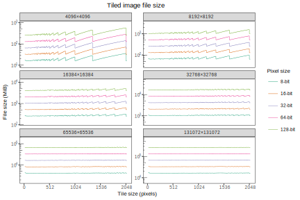
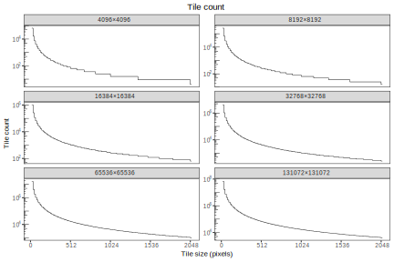
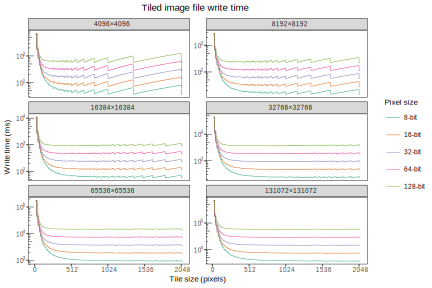
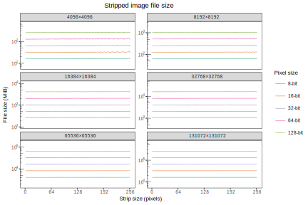
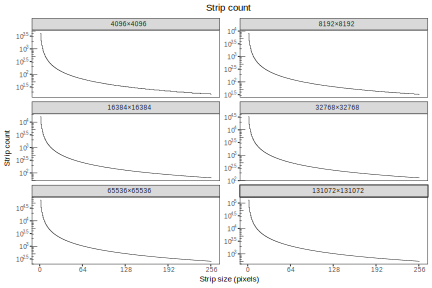
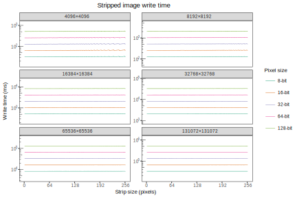

Tiling
======

OME Files supports the creation of images which are stored as a series
of tiles, using the :cpp:class:`FormatWriter` :cpp:func:`setTileSizeX`
and :cpp:func:`setTileSizeY` methods.  For the TIFF format, these are
stored as either tiles or strips.

When chosing a tile size for TIFF data, consider these factors:

- The tile size must be a multiple of 16
- The tile size should be a multiple of the image size or else storage
  space will be wasted due to tiles overlapping the right and/or bottom
  borders of the image
- A smaller tile size results in more tiles; there is a small storage
  overhead and a larger processing overhead which makes larger tile
  sizes more efficient
- Larger tile sizes do not affect write performance, but may affect
  read performance if it results in data being read and discarded;
  consider the read access patterns of the stored data

For images with a width less than 2048 pixels, the OME Files TIFF
writers currently default to writing strips of approximately 2\
:sup:`16` pixels (the strip size varies depending upon the image
width).  For images with a width of 2048 and larger, tiles are used
with a default size of 2\ :sup:`16` pixels (256×256).  These satisfy
the above requirements for many typical cases.  If your needs do not
match these defaults, please specify your own.  Consider profiling
with your own hardware and data for optimal performance.

The figures which follow detail various considerations when chosing an
appropriate tile size.  In all the figures, the separate panels show
images of different sizes, from small (4096×4096) to large
(131072×131072).  Different pixel types have different storage sizes,
with consequent changes in storage size and upon performance.  These
are shown on the panels as separate lines.

These plots were computed using :download:`an R script
<plots/tiling.R>`, based upon empirical testing with a `TIFF tiling
benchmark
<https://github.com/openmicroscopy/ome-files-performance/commit/8f6a8f3b25fd3761967b74366102466a590009f7>`__.

   The size of the TIFF file varies with different tile sizes and
   pixel types.  Tile sizes which overlap the image border use more
   space, which is most apparent with smaller images where it
   comprises a greater proportion of the total file size.  Lower tile
   sizes show a small increase in file size due to the storage of the
   tile offsets and sizes.

   As the tile size increases, the total number of tiles decreases.
   The wastage due to image overlap becomes less apparent as the image
   size increases.

   This plot combines the data from the previous plots with the
   timings derived from `this benchmark result
   <https://github.com/openmicroscopy/ome-files-performance/raw/8f6a8f3b25fd3761967b74366102466a590009f7/analysis/tile-test-write-performance.pdf>`__.
   It is not necessarily representative of the timings which would be
   observed in reality, where write caching, buffer copies and other
   confounding effects which are not modelled here may cause
   additional variation.

   The size of the TIFF file varies with different strip sizes and
   pixel types.  Strip sizes which overlap the image border use more
   space, which is most apparent with smaller images where it
   comprises a greater proportion of the total file size.  Lower strip
   sizes show a small increase in file size due to the storage of the
   tile offsets and sizes.

   As the strip size increases, the total number of strips decreases.
   The wastage due to image overlap becomes less apparent as the image
   size increases.

   This plot combines the data from the previous plots with the
   timings derived from `this benchmark result
   <https://github.com/openmicroscopy/ome-files-performance/blob/8f6a8f3b25fd3761967b74366102466a590009f7/analysis/strip-test-write-performance.pdf>`__.
   It is not necessarily representative of the timings which would be
   observed in reality, where write caching, buffer copies and other
   confounding effects which are not modelled here may cause
   additional variation.  Unlike the tile benchmark, the strip
   benchmark showed no observable effect of the strip count upon write
   time.
